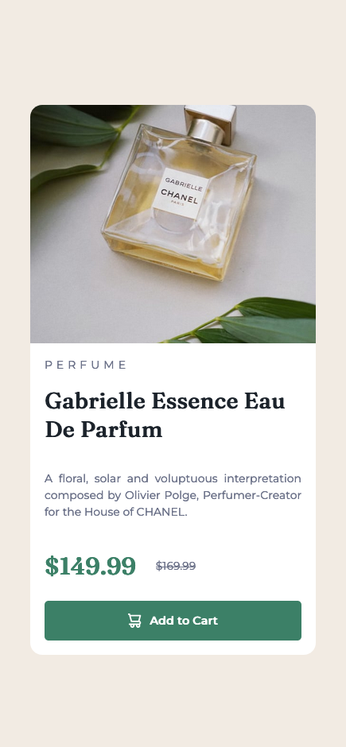

 
# Frontend Mentor - Product preview card component solution

This is a solution to the [Product preview card component challenge on Frontend Mentor](https://www.frontendmentor.io/challenges/product-preview-card-component-GO7UmttRfa). Frontend Mentor challenges help you improve your coding skills by building realistic projects. 

## Table of contents

- [Frontend Mentor - Product preview card component solution](#frontend-mentor---product-preview-card-component-solution)
  - [Table of contents](#table-of-contents)
  - [Overview](#overview)
    - [The challenge](#the-challenge)
    - [Screenshot](#screenshot)
    - [Links](#links)
  - [My process](#my-process)
    - [Built with](#built-with)
    - [What I learned](#what-i-learned)
    - [Continued development](#continued-development)
  - [Author](#author)


## Overview

### The challenge

Users should be able to:

- View the optimal layout depending on their device's screen size
- See hover and focus states for interactive elements

### Screenshot
Desktop view


Mobile view



### Links

- Solution URL: [Solution on Frontend Mentor](https://www.frontendmentor.io/solutions/responsive-product-preview-card-using-flexbox-jWwTzyyYDg)
- Live Site URL: [Live Site](https://product-preview-card-vivo.netlify.app/)

## My process

### Built with

- Semantic HTML5 markup
- CSS custom properties
- Flexbox

### What I learned

- The image at the left side cover the border of the card, the solution is to use `overflow` attribute
```css
overflow: hidden
```


### Continued development

- For future development, I might use Grid instead of Flexbox.


## Author
- LinkedIn - [/in/vivo1310](https://www.linkedin.com/in/vivo1310/)
- Github - [@vivo1310](https://github.com/vivo1310)
- Frontend Mentor - [@vivo1310](https://www.frontendmentor.io/profile/vivo1310)


